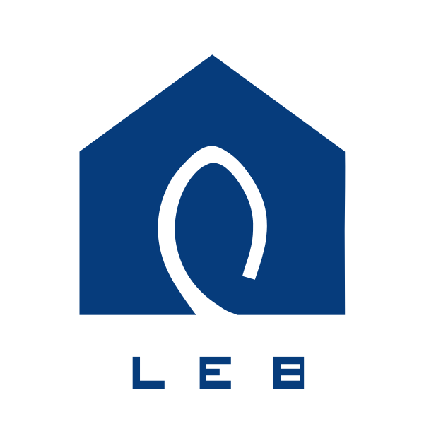
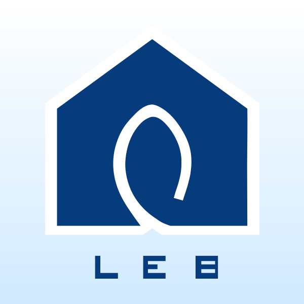
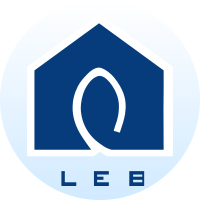
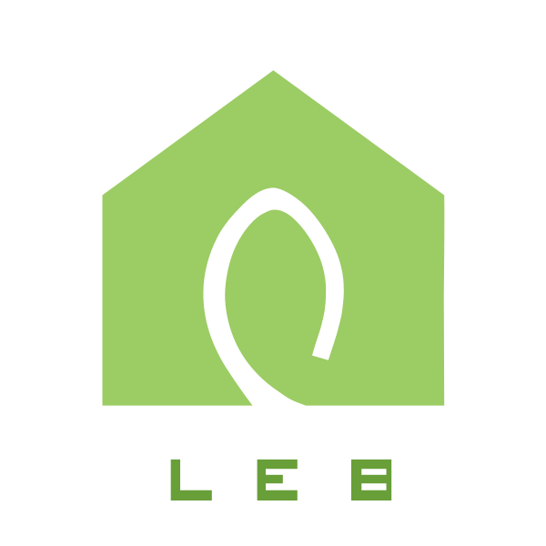
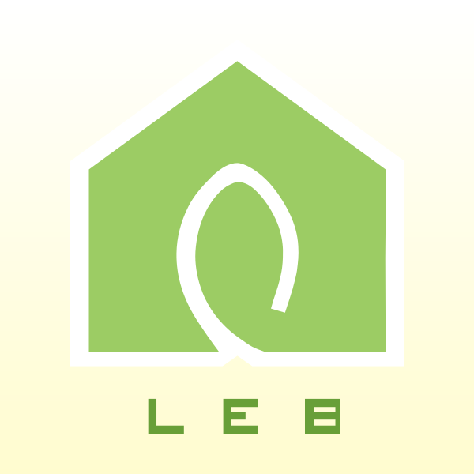
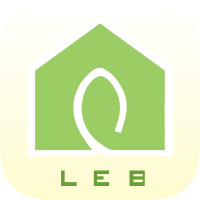
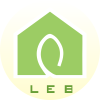

# 建筑数据团队 Logo
### 1.原版 Logo

蓝色的图标为原版 Logo，适用于各类正式的场合。例如建筑节能数字平台的图标，正式汇报文件的 Logo 图标等。

|                     蓝色透明                     |                     蓝色方形                     |                        蓝色圆角                        |                     蓝色圆形                     |
| :----------------------------------------------: | :----------------------------------------------: | :----------------------------------------------------: | :----------------------------------------------: |
|  |  |  |  |

### 2.原版数字平台文字 Logo

建筑节能数字平台的文字部分，使用的是 “方正小标宋简体”，字体文件在 `/font` 目录下。

### 3.数据团队 Logo

数据团队 Logo 由原版 Logo 改色而来，以节能的绿色为主色调，适用于各类团队图标、开发等场合。例如建筑节能数字小组的图标等。

|                     蓝色透明                     |                     蓝色方形                     |                        蓝色圆角                        |                     蓝色圆形                     |
| :----------------------------------------------: | :----------------------------------------------: | :----------------------------------------------------: | :----------------------------------------------: |
|  |  |  |  |

### 4.源文件

所有矢量 Logo 都是使用 Sketch 进行临摹的，因为源文件好像找不到了，只能拿现有的小尺寸 png 图片描绘绘制而成，部分细节肯定会存在一些细微的差距。源文件在 `/sketch` 目录下。

### 5.打包下载

所有打包文件可以在 [Release 页面](https://github.com/buildingdata/Logo/releases)下载。
