# 零能零碳建筑团队及平台 Logo
### 1.Logo

蓝色的图标为原版 Logo，适用于各类正式的场合。例如建筑节能平台的 Icon 和 App 图标，正式汇报文件的 Logo 标识等。

|                        蓝色透明                         |                        蓝色方形                         |                           蓝色圆角                           |                        蓝色圆形                         |
| :-----------------------------------------------------: | :-----------------------------------------------------: | :----------------------------------------------------------: | :-----------------------------------------------------: |
|   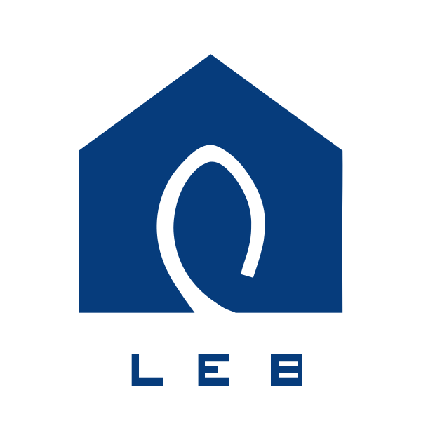   |   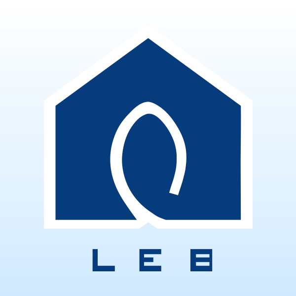   |     |   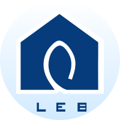   |
| 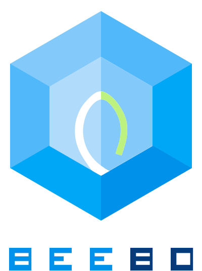 | 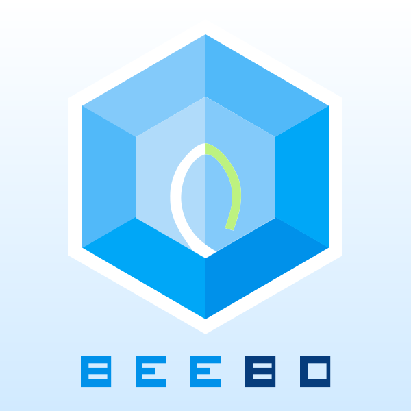 | 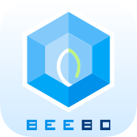 | 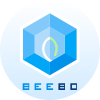 |

数据团队绿色 Logo 由原版设计改色而来，以节能的绿色为主色调，适用于各类团队图标、开发等场合，例如建筑节能数字小组的图标等。

|                        绿色透明                         |                        绿色方形                         |                           绿色圆角                           |                        绿色圆形                         |
| :-----------------------------------------------------: | :-----------------------------------------------------: | :----------------------------------------------------------: | :-----------------------------------------------------: |
|   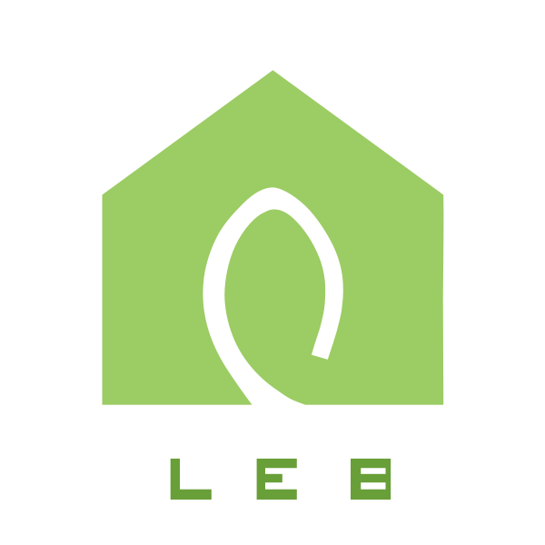   |   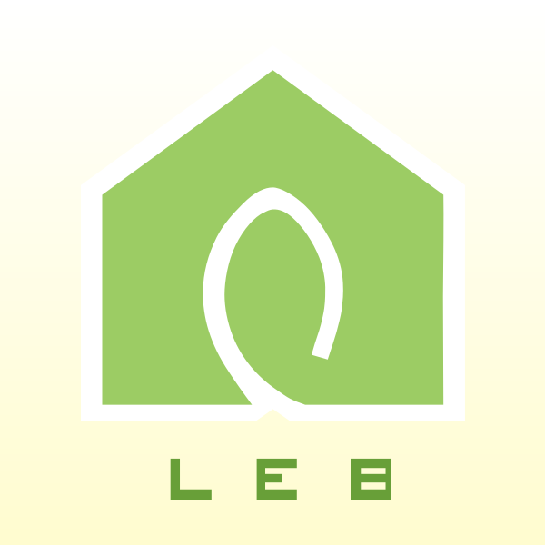   |     |   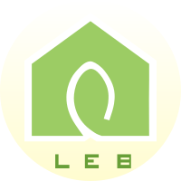   |
| 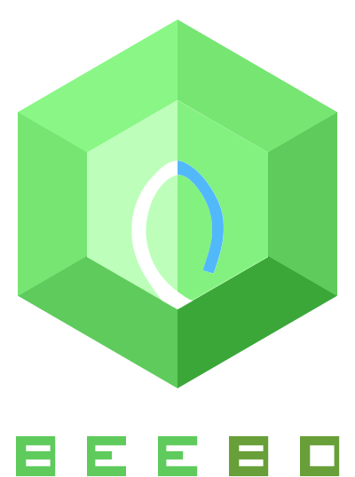 | 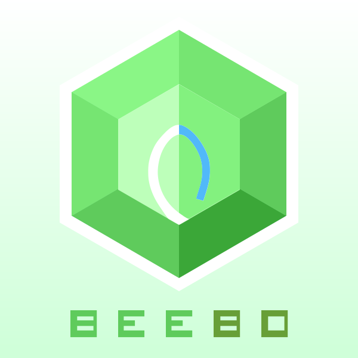 | 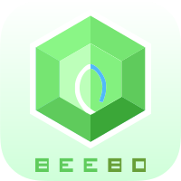 |  |

### 2.文字 Logo

|                  LEB                  |                   BEEBD                   |
| :-----------------------------------: | :---------------------------------------: |
|  | 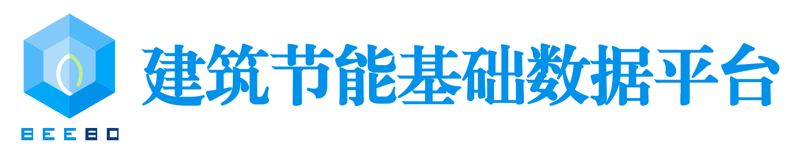 |
| 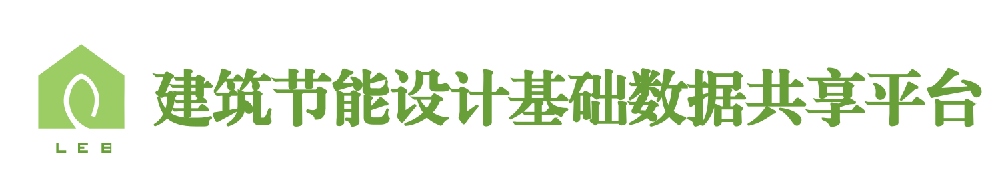 | 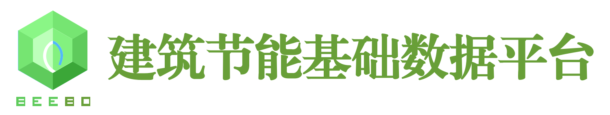 |

建筑节能数字平台的文字部分，使用的是 “方正小标宋简体”，字体文件在 `/font` 目录下。

### 3.源文件

矢量 Logo 都是使用 Sketch 进行临摹或绘制的，因为源文件好像找不到了，只能拿现有的小尺寸 png 图片描绘绘制而成，部分细节肯定会存在一些细微的差距。源文件在 `/sketch` 目录下。

### 4.打包下载

所有打包文件可以在 [Release 页面](https://github.com/buildingdata/Logo/releases)下载。

------

**附：XAUAT Logo**

|  彩色  |  白色  |
| :----------------------------------------------: | :----------------------------------------------: |
|  | 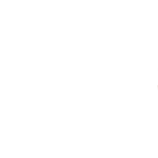 |

