# 零能零碳建筑团队标识
### 1. 标识

#### LEB 标识

LEB 标识不知道是谁设计的，我只是对它进行了矢量化，这个标识主要用于团队的标识，以及建筑节能基础数据平台的 Icon 和 App 图标。

|                        透明                         |                        方形                         |                           圆角                            |                        圆形                         |
| :-------------------------------------------------: | :-------------------------------------------------: | :-------------------------------------------------------: | :-------------------------------------------------: |
| 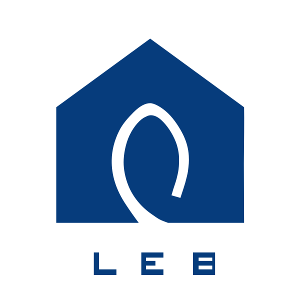 | 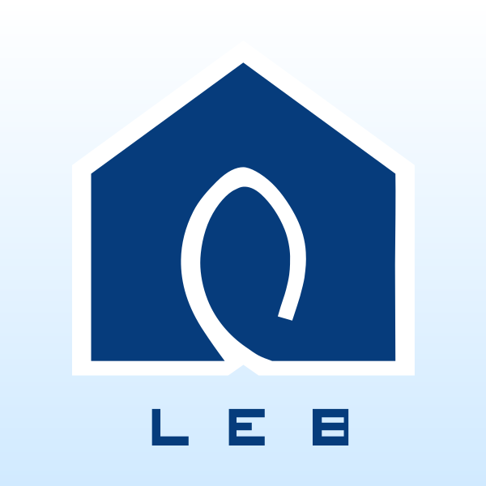 |  | 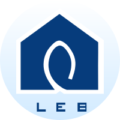 |
| 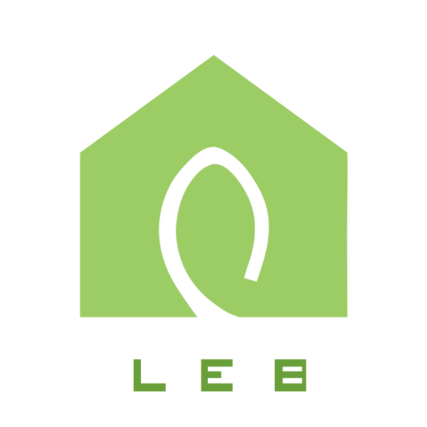 | 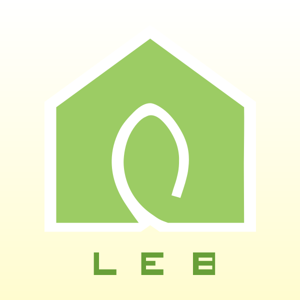 | 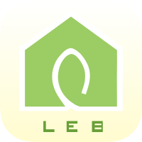 | 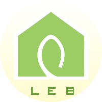 |

#### BEEFD 标识

此标识由原版设计改色而来，以节能的绿色为主色调，适用于新数据平台的 Icon 和 App 图标。

|                          透明                           |                          方形                           |                             圆角                             |                          圆形                           |
| :-----------------------------------------------------: | :-----------------------------------------------------: | :----------------------------------------------------------: | :-----------------------------------------------------: |
| 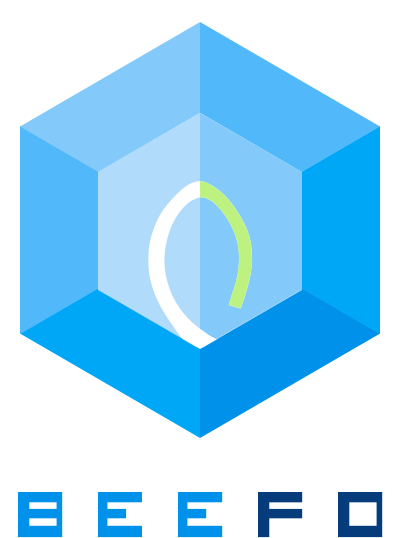 | 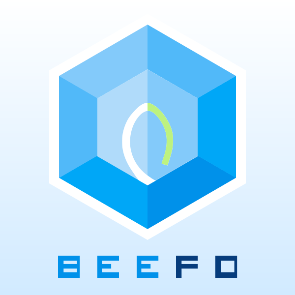 | 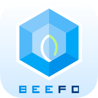 | 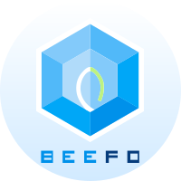 |
|  | 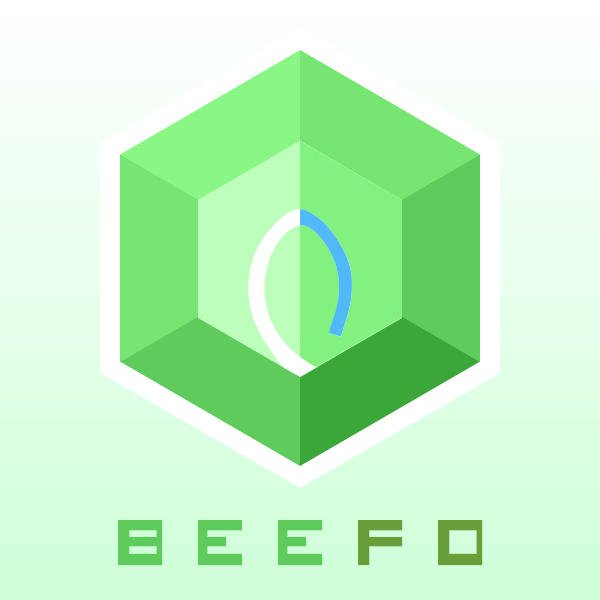 | 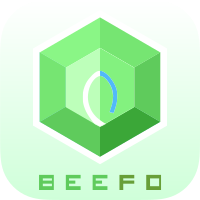 |  |

#### UCDT 标识

城市碳数字孪生的标识，采用二氧化碳分子结构式「O=C=O」进行设计。主要用于碳排放课题组、数字孪生平台的 Icon 和 App 图标。

|                         蓝色                          |                         红色                          |                         橙色                          |                         绿色                          | 紫色                                                  |
| :---------------------------------------------------: | :---------------------------------------------------: | :---------------------------------------------------: | :---------------------------------------------------: | ----------------------------------------------------- |
| 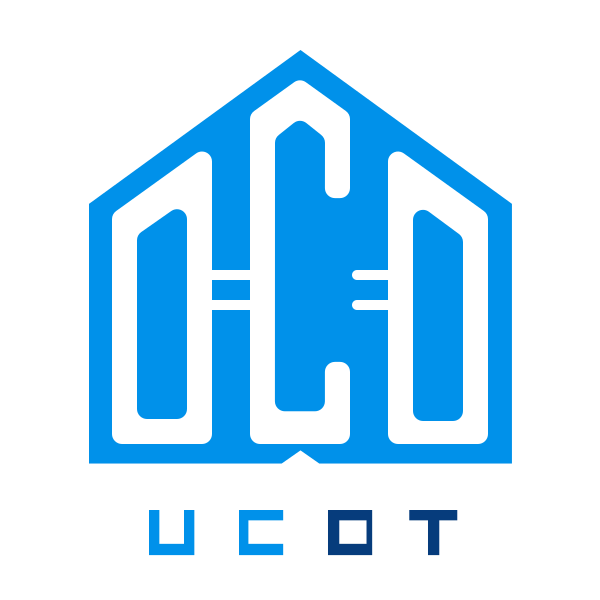 | 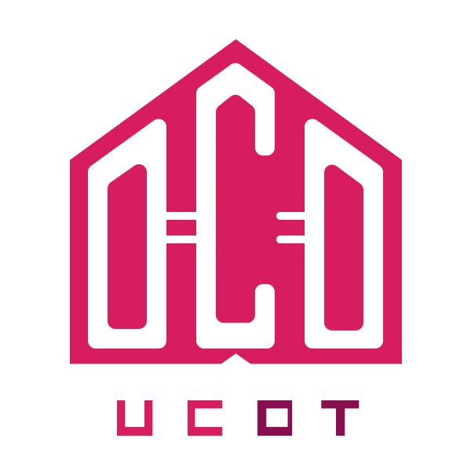 | 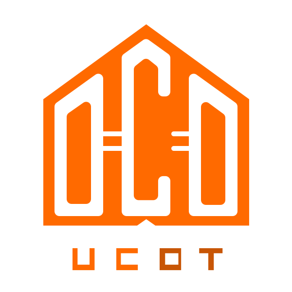 | 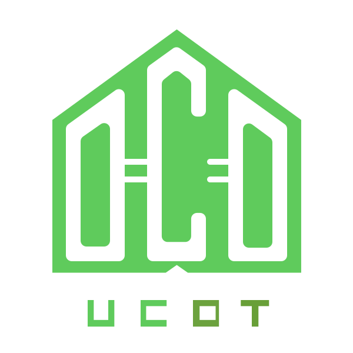 | 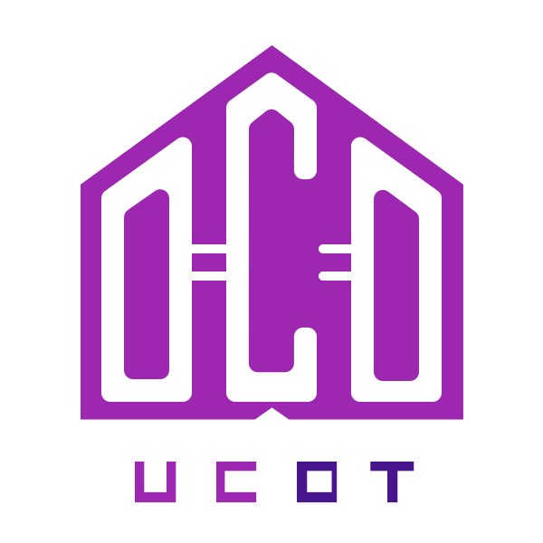 |
| 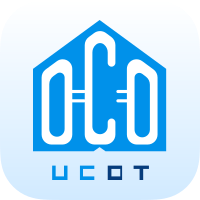 | 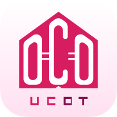 | 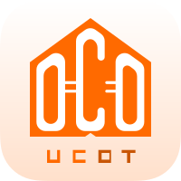 | 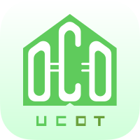 | 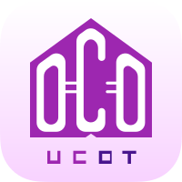 |

### 2.文字 Logo

|                          LEB                          |                          BEEFD                          |
| :---------------------------------------------------: | :-----------------------------------------------------: |
|    | 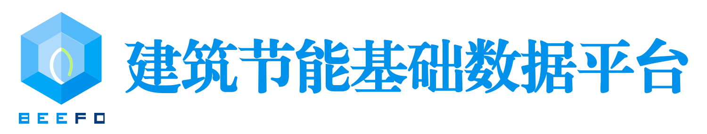 |
|  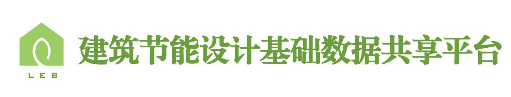  | 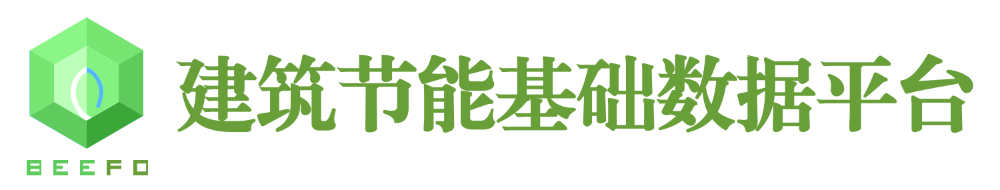 |
| 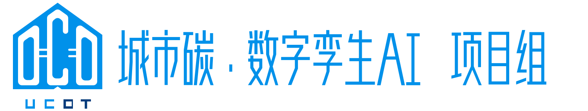 |                                                         |

为了新平台实现多语言，现更新繁体中文、英文两款文字标识：

|                            繁体                             |                           English                           |
| :---------------------------------------------------------: | :---------------------------------------------------------: |
| 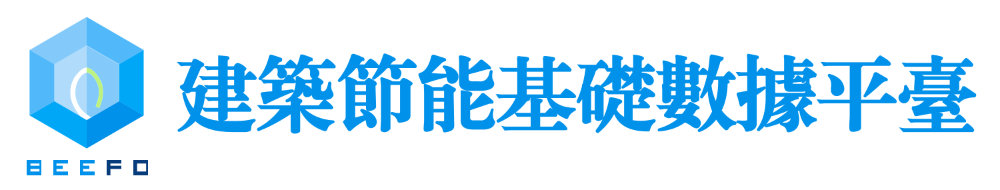 | 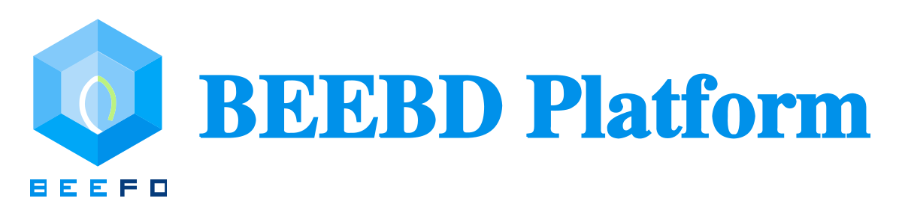 |

建筑节能数字平台的文字部分，使用的是 “方正小标宋简体” 与 “方正小标宋繁体”，字体文件在 `/font` 目录下可见。

### 3.源文件

矢量 Logo 都是使用 Sketch 进行临摹或绘制的，因为源文件好像找不到了，只能拿现有的小尺寸 png 图片描绘绘制而成，部分细节肯定会存在一些细微的差距。源文件在 `/sketch` 目录下。

### 4.打包下载

所有打包文件可以在 [Release 页面](https://github.com/buildingdata/Logo/releases)下载。

------

**附：XAUAT Logo**

|  彩色  |  白色  |
| :----------------------------------------------: | :----------------------------------------------: |
|  | 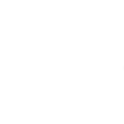 |
|  | 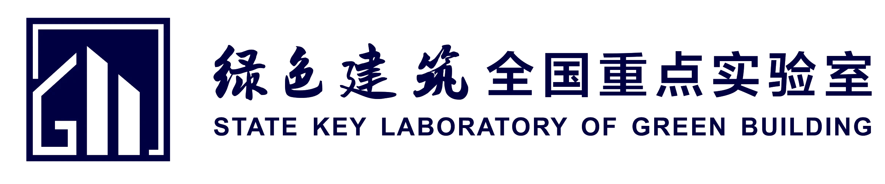 |

